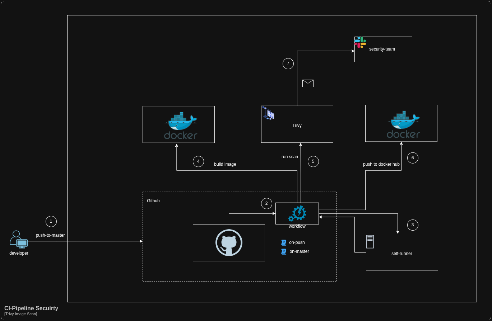

# CI Pipeline – Build & Trivy Security Scan
This repository contains a GitHub Actions workflow that automatically builds a Docker image and performs a security scan using Trivy before pushing the image to Docker Hub.
The pipeline ensures that every change to the master branch or a pull request is validated, scanned, and published securely.
---

## Required Secrets
### Add the following secrets in Settings => Secrets and variables => Actions:
- DOCKERHUB_USERNAME
- DOCKERHUB_TOKEN

### Repository Variables
- DOCKER_REPOSITORY_OWNER_USERNAME
- DOCKER_IMAGE_NAME

## Security Scan Settings (Trivy)
The scan checks for:
- CRITICAL vulnerabilities
- HIGH vulnerabilities
- Both OS packages and libraries

The pipeline does not fail the build on vulnerabilities because ``exit-code: 0``.
You can enforce failing on CVEs by changing:
```bash
exit-code: '1'
```

## Docker Image Naming Convention
Every build is tagged using the commit SHA:
```bash
docker.io/${{ vars.DOCKER_REPOSITORY_OWNER_USERNAME }}/${{ vars.DOCKER_IMAGE_NAME }}:${{ github.sha }}
```

## When Does the Pipeline Run?
- Every push to the master branch
- On every pull request

